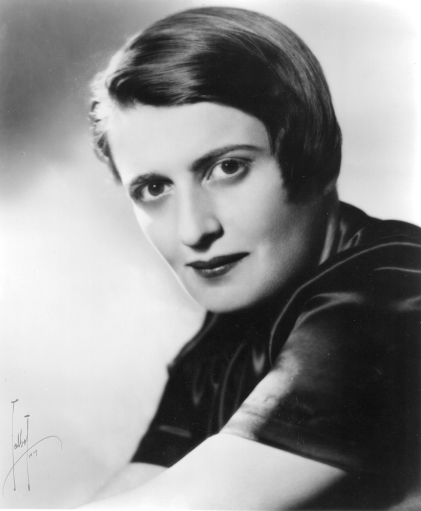

# Ayn Rand

| Attribute      | Description              |
| -------------- | ------------------------ |
| **Birth**      | 1905 CE                  |
| **Death**      | 1982 CE                  |
| **Era**        | Post-Modern Philosophy   |
| **School**     | Objectivism, Egoism      |
| **Punk Level** | Anti-Punk                |

 

 

Ayn Rand (February 2 1905 – March 6, 1982) was a Russian-American writer and philosopher. She is known for her two best-selling novels, The Fountainhead and Atlas Shrugged, and for developing a philosophical system she named Objectivism. Born and educated in Russia, she moved to the United States in 1926. She had a play produced on Broadway in 1935 and 1936. After two early novels that were initially unsuccessful, she achieved fame with her 1943 novel, The Fountainhead. In 1957, Rand published her best-known work, the novel Atlas Shrugged. Afterward, she turned to non-fiction to promote her philosophy, publishing her own periodicals and releasing several collections of essays until her death in 1982.

Rand advocated reason as the only means of acquiring knowledge and rejected faith and religion. She supported rational and ethical egoism and rejected altruism. In politics, she condemned the initiation of force as immoral and opposed collectivism and statism as well as anarchism, instead supporting laissez-faire capitalism, which she defined as the system based on recognizing individual rights, including property rights. In art, Rand promoted romantic realism. She was sharply critical of most philosophers and philosophical traditions known to her, except for Aristotle, Thomas Aquinas and classical liberals.
