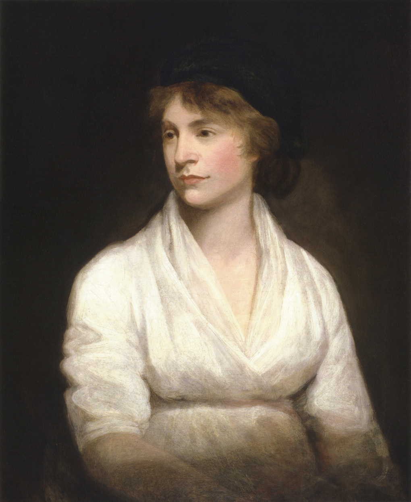

# Mary Wollstonecraft

| Attribute      | Description              |
| -------------- | ------------------------ |
| **Birth**      | 1759 CE                  |
| **Death**      | 1797 CE                  |
| **Era**        | Modern Philosophy        |
| **School**     | Early feminist thought   |
| **Punk Level** | High                     |

&nbsp;

&nbsp;

Mary Wollstonecraft (27 April 1759 – 10 September 1797) was an English writer, philosopher, and advocate of women's rights. Until the late 20th century, Wollstonecraft's life, which encompassed several unconventional personal relationships at the time, received more attention than her writing. Today Wollstonecraft is regarded as one of the founding feminist philosophers, and feminists often cite both her life and her works as important influences.

During her brief career, she wrote novels, treatises, a travel narrative, a history of the French Revolution, a conduct book, and a children's book. Wollstonecraft is best known for A Vindication of the Rights of Woman (1792), in which she argues that women are not naturally inferior to men, but appear to be only because they lack education. She suggests that both men and women should be treated as rational beings and imagines a social order founded on reason.
